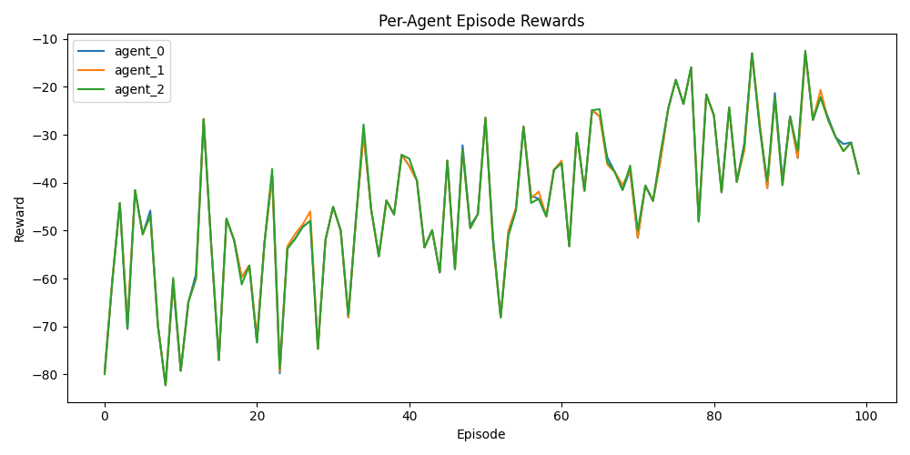

# Multi-Agent QMIX with PettingZoo

This project implements the QMIX algorithm for cooperative multi-agent reinforcement learning using the PettingZoo MPE environments.

## Features

- Multi-agent QMIX implementation in PyTorch
- Compatible with PettingZoo's MPE environments
- Training, evaluation, and visualization scripts included
- Plots for episode rewards, training loss, agent coordination, and per-agent rewards
- **Advanced MARL features:**
  - Robustness to agent failure (random agent dropout)
  - Agent specialization (blind agent)
  - Simple inter-agent communication (message passing)
  - Non-stationarity handling (fingerprinting)

---

## Example Output

### Training and Evaluation Plots




### Sample Console Output

```
Episode 0, Avg Reward (last 10): -34.89, Epsilon: 0.99
Episode 10, Avg Reward (last 10): -33.46, Epsilon: 0.95
Episode 20, Avg Reward (last 10): -26.17, Epsilon: 0.90
...
Episode 0, Failed agents: [], Rewards: [-40.14, -40.14, -40.14]
Episode 1, Failed agents: [], Rewards: [-21.99, -21.99, -21.99]
Episode 2, Failed agents: [], Rewards: [-41.93, -41.93, -41.93]
Episode 3, Failed agents: [], Rewards: [-46.90, -46.90, -46.90]
Episode 4, Failed agents: [], Rewards: [-54.09, -53.59, -54.09]
Episode 5, Failed agents: [], Rewards: [-22.71, -24.21, -24.21]
Episode 6, Failed agents: [], Rewards: [-29.01, -29.01, -29.01]
Episode 7, Failed agents: ['agent_0'], Rewards: [-30.29, -29.29, -28.79]
Episode 8, Failed agents: ['agent_0'], Rewards: [-23.22, -23.22, -23.22]
Episode 9, Failed agents: [], Rewards: [-29.06, -29.06, -29.06]
Episode 10, Failed agents: ['agent_2'], Rewards: [-64.84, -63.84, -64.84]
...
```


## Setup Instructions

### 1. Clone the Repository

```bash
git clone <your-repo-url>
cd marl_project_2
```

### 2. Create and Activate a Virtual Environment (Recommended)

```bash
python -m venv venv
# On Windows:
venv\Scripts\activate
# On Unix/Mac:
source venv/bin/activate
```

### 3. Install Dependencies

All required packages are listed in `requirements.txt`:

```bash
pip install -r requirements.txt
```

**Dependencies:**
- torch >= 1.9.0
- pettingzoo[mpe] == 1.24.3
- numpy >= 1.21.0
- matplotlib >= 3.4.0

---

## How to Run Experiments

### 1. Train QMIX Agents

Run the main training script:

```bash
python main.py
```

This will:
- Train QMIX agents in a multi-agent environment
- Save training results and plots (e.g., `qmix_training_results.png`, `per_agent_rewards.png`)
- Print per-agent rewards and failed agent info for each episode

### 2. Visualize Results

The training script automatically generates plots using `visualize.py`.  
If you want to plot results manually, you can use the `plot_results` function in `visualize.py`:

```python
from visualize import plot_results

# Example usage:
plot_results(episode_rewards, losses, agent_distances, filename="qmix_training_results.png", agent_rewards=agent_rewards)
```

---

## Usage Guide & Analysis

- **Per-Agent Rewards:**
  - The console output and `per_agent_rewards.png` show the reward for each agent per episode.
  - Compare the blind agent (agent_1) to others to analyze specialization/diversity.
- **Robustness:**
  - The console output shows which agent was failed (random actions) each episode.
  - Analyze how team performance changes when an agent is failed.
- **Coordination:**
  - The average distance plot shows how well agents coordinate.
- **Non-Stationarity:**
  - Fingerprinting is used in the replay buffer and agent input to help stabilize learning.
- **Communication:**
  - Agents pass a simple message (max Q-value) to each other at each step.

---

## Project Structure

```
.
├── agent.py           # Agent network definition (with comm/fingerprint)
├── environment.py     # Multi-agent environment wrapper (specialization, failure)
├── main.py            # Main training and evaluation script
├── qmix.py            # QMIX and mixing network implementation
├── train.py           # Training loop and replay buffer (with fingerprinting)
├── visualize.py       # Plotting utilities (per-agent, coordination)
├── requirements.txt   # Python dependencies
└── ...
```

---

## Customization

- **Change number of agents or environment:** Edit the parameters in `main.py`.
- **Adjust training settings:** Modify `num_episodes`, epsilon, or buffer size in `main.py` or `train.py`.
- **Plot customization:** Edit `visualize.py` for different plot styles or metrics.
- **Try other specializations:** Set different agents as blind or with different reward functions in `environment.py`.

---

## Troubleshooting

- If you encounter issues with PettingZoo or torch, ensure your Python version is compatible (Python 3.7+ recommended).
- For CUDA support, install the appropriate version of torch for your GPU.

---
